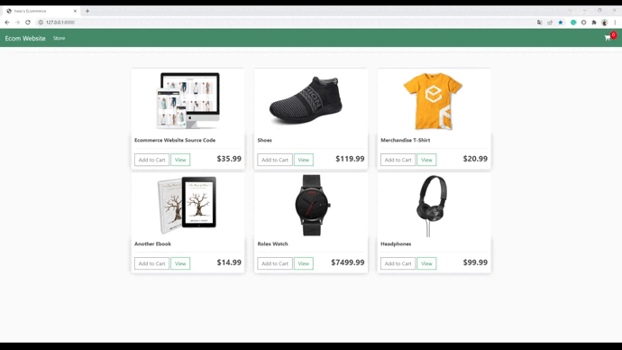

# django-ecommerce-website
### An ecommerce applicaton made by [Ivan "John Ivess" Shyika](https://www.youtube.com/c/JohnIvess).

#### Check it out:
[Ecommerce App Website](https://ivess-ecommerce.herokuapp.com/) (hosted by Heroku)

[Ecommerce App on GitHub](https://github.com/IvessJohn/django-ecommerce-website) (this page)

## Project description:
Order products, edit your order, and process it.

_*More demo materials available in [publicity/](publicity/)_

---

## Features:
- Both authenticated and unauthenticated users can order the goods (authenticated is handled by the backend, unauthenticated handled by JS and cookies)

### Functionality:

Store page:
- Look through the available products
- Add products to your cart

Cart page:
- See the summary of your order
- See your ordered items with basic info on them

Checkout page:
- See your order's summary
- Apply a coupon to your order _(only for authenticated users)_
- Pay for your order using PayPal

---

## Credits

**Used tools**: Django 4.0, Python 3.10.

## Integrations:
- [django-coupon-management](https://pypi.org/project/django-coupon-management/)
- [django-countries](https://pypi.org/project/django-countries/)
- [PayPal Buttons](https://developer.paypal.com/demo/checkout/#/pattern/style)

### Supporting libraries
- Google Fonts
- [Font Awesome v5.6.1](https://fontawesome.com/)
- Bootstrap v4.1.3
- jQuery v3.3.1
- [Pillow](https://pypi.org/project/Pillow/)
